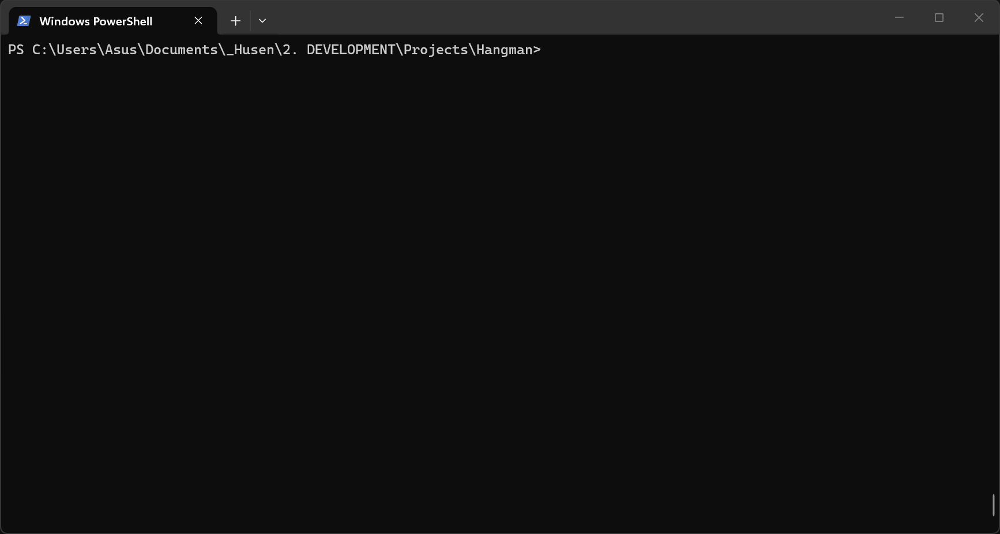

<h1 align="center">
  ☠️ Hangman: Terminal Edition
</h1>

<p align="center">
  <b>A modern, vibrant, and over-engineered CLI take on the classic game of Hangman.</b><br>
  Built with Python, Rich, and a lot of dead ASCII stickmen.
</p>

<p align="center">
  
  
  
</p>

<p align="center">
  
</p>

<hr>

## 📖 Table of Contents
- [Motivation](#-motivation)
- [Features](#-features)
- [Architecture](#-architecture)
- [Installation](#-installation)
- [Usage](#-usage)

---

## 🧠 Motivation

I built this project to revise and solidify my core Python skills. Instead of just printing text to the console, I wanted to take a universally understood logic puzzle (Hangman) and use it as a sandbox to practice writing **production-grade, professional Python code**. 

By completely over-engineering a simple game, I leveled up in several core concepts:
- **Object-Oriented Programming (OOP):** Encapsulating state cleanly inside a `Hangman` class instead of relying on messy global variables.
- **Software Design Patterns:** Implementing a strict **MVC (Model-View-Controller)** architecture.
- **Advanced CLI UIs:** Learning the `rich` library to build responsive `Table.grid` layouts and handle truecolor terminal output.
- **Data Persistence:** Using `json` and file I/O to safely manage a local scoreboard across sessions without corrupting data.
- **Robust Error Handling:** Writing airtight guard clauses for user input and gracefully handling `KeyboardInterrupt` exits.

---

## ✨ Features

- **Vibrant Dashboard UI:** A shrink-wrapped, centered UI built with `rich` that feels like a cohesive app, not a script.
- **Smart Input Validation:** Fool-proof input handling. Type whatever you want; the game won't crash.
- **Difficulty Scaling:** Easy, Medium, and Hard modes (Hard mode disables hints!).
- **Persistent Scoreboard:** Your wins and losses are tracked locally so you can prove your streak.
- **Dual Execution:** Play via the styled interactive menu, or bypass it entirely using fast-track CLI arguments.

---

## 🏗️ Architecture

The codebase is strictly separated by concerns, making it highly modular and easy to read:

```text
Hangman
 ┣ main.py   (Controller: Orchestrates the game loop, input, and CLI args)
 ┣ game.py   (Model: Handles core Hangman logic, sets, and state)
 ┣ ui.py     (View: Strictly handles rendering the rich components and layouts)
 ┣ stats.py  (Storage: Manages reading/writing the persistent JSON scoreboard)
 ┗ words.py  (Data: The repository for categories and hidden words)
```

---

## 🚀 Installation

Ensure you have **Python 3.10+** installed on your machine.

1. Clone the repository:
   ```bash
   git clone https://github.com/yourusername/hangman-cli.git
   cd hangman-cli
   ```

2. Install the required dependencies:
   ```bash
   pip install rich
   ```

---

## 🎮 Usage

### Option 1: Interactive Menu
Run the main script and let the beautiful on-screen menu guide you.
```bash
python main.py
```

### Option 2: CLI Fast-Track
Know exactly what you want to play? Pass your arguments directly to bypass the menu:
```bash
# Example: Play the 'movies' category on 'hard' difficulty
python main.py -c movies -d hard
```

<details>
<summary><b>View all CLI options</b></summary>
<br>

```text
usage: main.py [-h] [-c CATEGORY] [-d {easy,medium,hard}]

Hangman Quick Round

options:
  -h, --help            show this help message and exit
  -c CATEGORY, --category CATEGORY
                        Selecting a category
  -d {easy,medium,hard}, --difficulty {easy,medium,hard}
                        Selecting the difficulty
```

</details>

---
<p align="center"><i>Created by Husen</i></p>